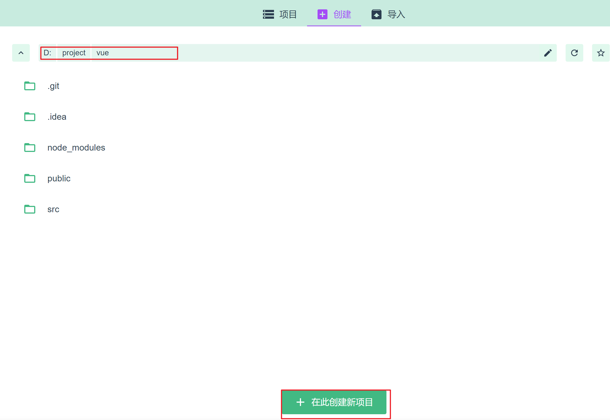
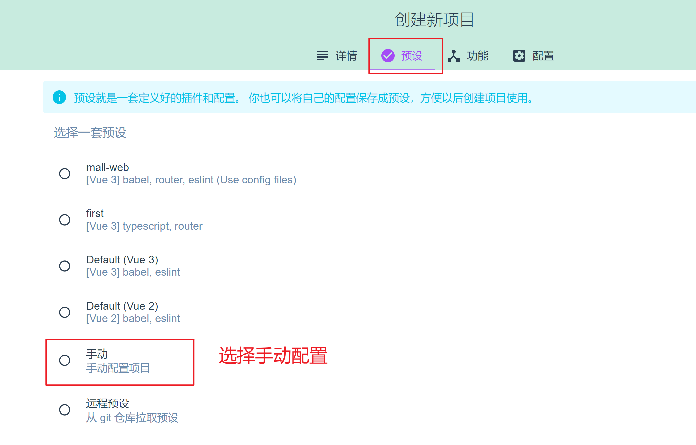
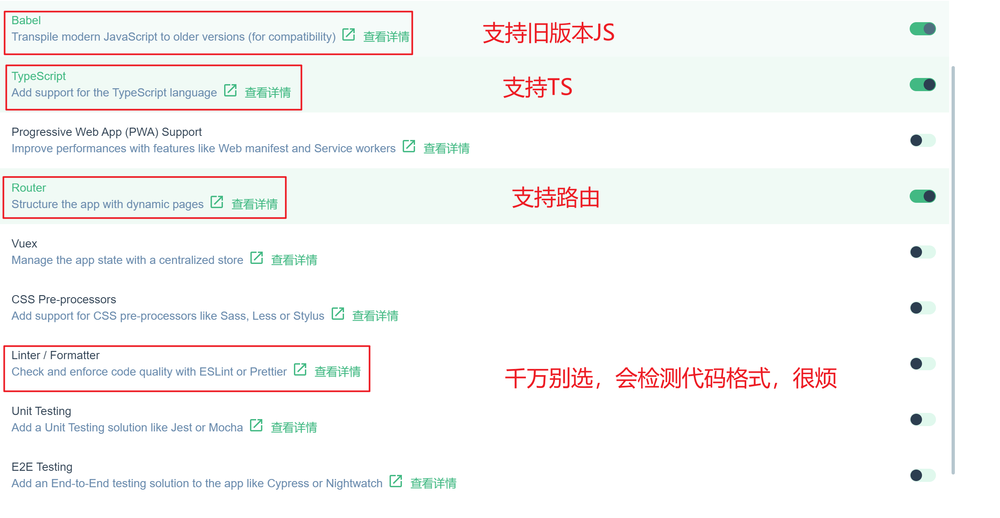
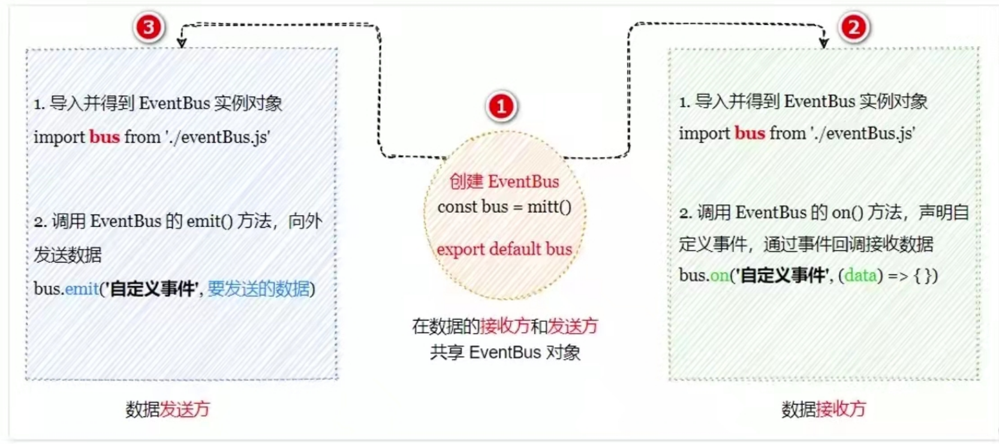

# 新建项目

```shell
vue ui
```







# 配置axios

```shell
npm i axios -S --legacy-peer-deps
```

```javascript
import axios from "axios";

// 默认配置
const instance = axios.create({
    baseURL: 'http://localhost:8443/chatroom/api',
    timeout: 10000,
    withCredentials: true,
    headers: {
        post: {
            "Content-Type": "application/json"
        }
    }
})

export default instance
```

## 使用案例

```javascript
instance.post('/login', {
        username: username.value,
        password: password.value
    })
    .then(successResponse => {
        if (successResponse.data.code === 200) {
            this.$router.replace('/chat')
        }else {
            divtext.value = "账号或密码错误"
        }
    })
    .catch(failResponse => {
        divtext.value = "服务器未响应"
    })
```

# 配置element-plus

```shell
npm install element-plus --legacy-peer-deps
```

在main.ts引入emement-plus

```javascript
import ElementPlus from 'element-plus';//1.引入组件
import 'element-plus/dist/index.css';//2.引入css
```

#	组件数据共享

## 兄弟组件的数据共享——EventBus

vue3中移除了事件总线，需要借助第三方 mitt 实现



1.安装 mitt

```shell
npm install mitt --legacy-peer-deps
```

2.新建 eventbus.ts

```javascript
// 导入mitt包
import mitt from 'mitt'
// 创建EventBus实例对象
const bus = mitt()
// 共享出eventbus的实例对象
export default bus
```


3.在数据接收方自定义事件
通过 bus.on('事件名',事件处理函数) 的方法注册一个自定义事件

```html
<template>
  <div>
    <h3>数据接收方</h3>
    <p>num的值：{{ num }}</p>
  </div>
</template>
<script setup>
import { ref } from 'vue'
import bus from './eventbus'
const num = ref(0)
bus.on('countChange', (count) => {
  num.value = count
})
</script>
```


4.在事件发送方触发事件
通过 bus.emit('事件名',要发送的数据） 触发自定义事件

```html
<template>
  <div>
    <h3>数据发送方</h3>
    <p>count的值：{{ count }}</p>
    <button @click="addCount">增加count值</button>
  </div>
</template>
<script setup>
import { ref } from 'vue'
import bus from './eventbus'
const count = ref(0)
const addCount = () => {
  count.value++
  bus.emit('countChange', count)
}
</script>
```

